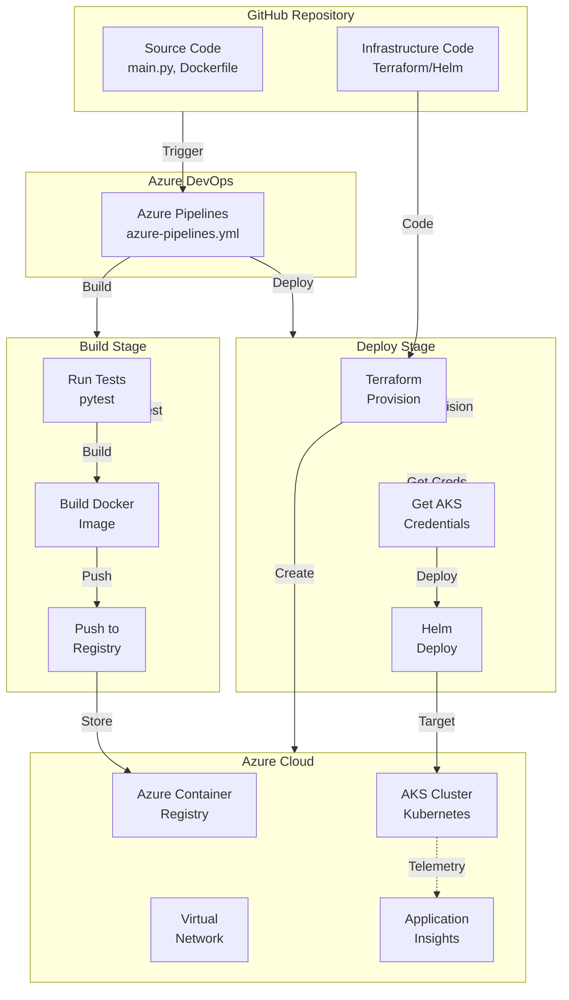
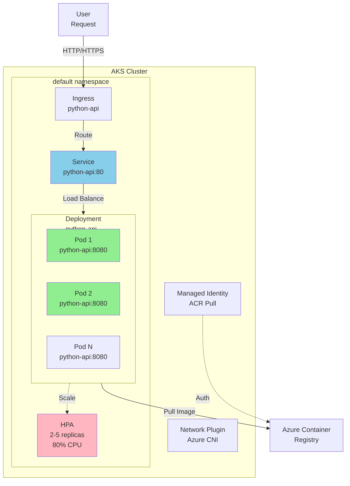
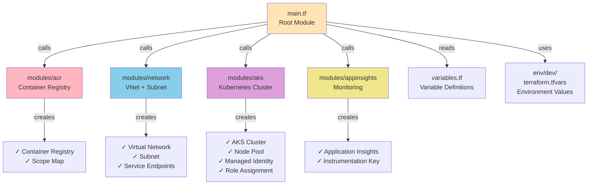
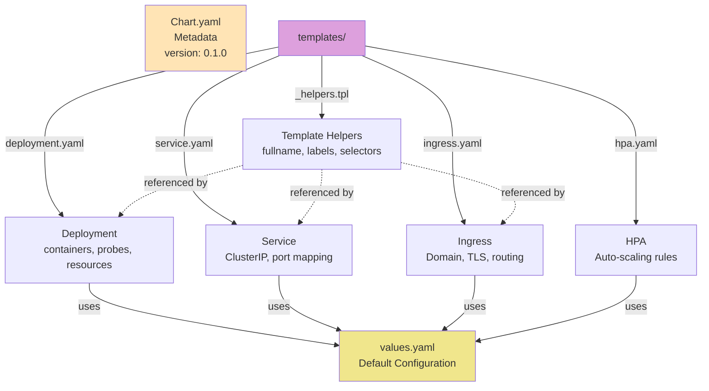
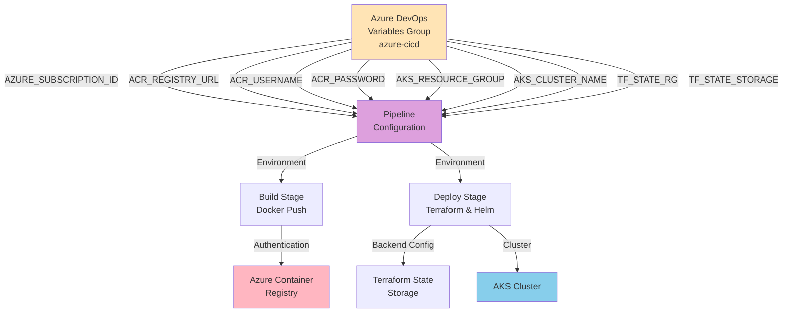
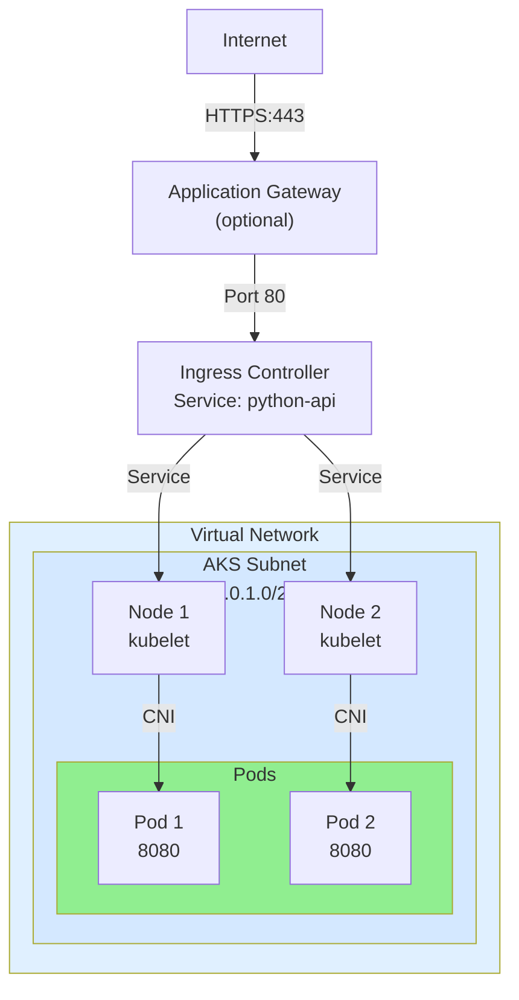

# Azure CI/CD Architecture Diagrams

## 1. High-Level System Architecture



## 2. Build Pipeline Detail

```mermaid
graph LR
    A["Commit<br/>main/develop"]
    B["Trigger<br/>Pipeline"]
    C["Python 3.11<br/>Environment"]
    D["Install<br/>Requirements"]
    E["Run pytest<br/>Tests"]
    F["Build<br/>Docker Image"]
    G["Tag Image<br/>build-id"]
    H["Push to<br/>ACR"]
    I["Success?<br/>✓"]
    
    A -->|on commit| B
    B -->|Setup| C
    C -->|Install deps| D
    D -->|Run tests| E
    E -->|Success| F
    F -->|Tag| G
    G -->|Push| H
    H -->|Complete| I
    
    style E fill:#90EE90
    style H fill:#87CEEB
    style I fill:#FFD700
```



## 3. Deploy Pipeline to AKS

```mermaid
graph LR
    A["Terraform<br/>Init"]
    B["Plan<br/>Changes"]
    C["Apply<br/>Resources"]
    D["AKS Created"]
    E["Get<br/>Credentials"]
    F["Update Helm<br/>Values"]
    G["Install/Upgrade<br/>Release"]
    H["Verify<br/>Rollout"]
    I["Success<br/>✓"]
    
    A -->|Backend config| B
    B -->|tfvars| C
    C -->|Creates| D
    D -->|Authenticated| E
    E -->|Update image tag| F
    F -->|Apply| G
    G -->|Check status| H
    H -->|Healthy| I
    
    style D fill:#FFB6C1
    style G fill:#DDA0DD
    style I fill:#FFD700
```



## 4. Kubernetes Cluster Architecture



## 5. Infrastructure as Code Structure



## 6. Helm Chart Structure



## 7. Data Flow - From Commit to Running Pod

```mermaid
graph LR
    A["Developer<br/>Commits"]
    B["GitHub<br/>Webhook"]
    C["Azure Pipelines<br/>Triggered"]
    D["Build Agent<br/>Pool"]
    E["Test Code"]
    F["Build Image<br/>esedemo:123"]
    G["Push to ACR"]
    H["Terraform<br/>Applies"]
    I["Helm<br/>Install"]
    J["Kubernetes<br/>Scheduler"]
    K["Pull Image<br/>from ACR"]
    L["Run Pod<br/>python-api:8080"]
    M["Service Routes<br/>Traffic"]
    N["Application<br/>Processes<br/>Request"]
    
    A -->|push| B
    B -->|notify| C
    C -->|dispatch| D
    D -->|execute| E
    E -->|success| F
    F -->|upload| G
    G -->|ready| H
    H -->|infrastructure| I
    I -->|manifest| J
    J -->|schedule| K
    K -->|authenticated| L
    L -->|healthy| M
    M -->|route| N
    
    style A fill:#90EE90
    style F fill:#FFB6C1
    style G fill:#87CEEB
    style L fill:#90EE90
    style N fill:#FFD700
```



## 8. Pipeline Variables Flow



## 9. Deployment Timeline

```
Day 1: Setup Week
├─ Azure DevOps project creation      [1 hour]
├─ Service connections                [30 min]
├─ Terraform state storage            [15 min]
└─ Pipeline variables                 [15 min]

First Run: Infrastructure (15-20 min)
├─ Tests run                          [2 min]
├─ Docker image build                 [3 min]
├─ Push to ACR                        [1 min]
├─ Terraform init/plan                [2 min]
├─ Terraform apply (AKS creation)     [10-15 min] ⏱️
├─ Get AKS credentials                [1 min]
├─ Helm deploy                        [2 min]
└─ Rollout verification               [1 min]

Subsequent Runs: (2-5 min)
├─ Tests run                          [2 min]
├─ Docker image build & push          [2 min]
├─ Terraform apply (if changed)       [varies]
├─ Helm upgrade                       [1 min]
└─ Rollout verification               [1 min]
```

## 10. Network Architecture



---

These diagrams illustrate:
1. **Overall System** - How all components interact
2. **Build Process** - Testing and Docker image creation
3. **Deployment Process** - AKS provisioning and Helm deployment
4. **Kubernetes Architecture** - Pods, services, and ingress
5. **Infrastructure Code** - Terraform module organization
6. **Helm Structure** - Kubernetes manifests management
7. **Data Flow** - From commit to running application
8. **Configuration** - How variables flow through pipeline
9. **Timeline** - Expected execution times
10. **Networking** - Cloud networking architecture
