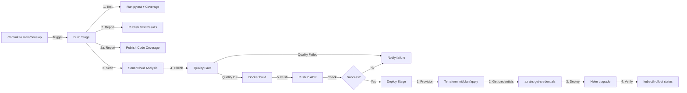

# Azure CI/CD Implementation - Quick Reference

## ✅ Files Created/Updated

### Pipeline Configuration
- `azure-pipelines.yml` - Main Azure DevOps pipeline with Build & Deploy stages

### Infrastructure as Code (Terraform)
- `infra/main.tf` - Root Terraform configuration
- `infra/variables.tf` - Variable definitions
- `infra/env/dev/terraform.tfvars` - Dev environment values
- `infra/modules/acr/main.tf` & `variables.tf` - Azure Container Registry module
- `infra/modules/aks/main.tf` & `variables.tf` - Azure Kubernetes Service module
- `infra/modules/network/main.tf` & `variables.tf` - Virtual Network module
- `infra/modules/appinsights/main.tf` & `variables.tf` - Application Insights module

### Kubernetes & Helm
- `manifests/helm/python-api/Chart.yaml` - Helm chart metadata
- `manifests/helm/python-api/values.yaml` - Helm values (enhanced with autoscaling, resources, etc.)
- `manifests/helm/python-api/templates/_helpers.tpl` - Helm template helpers
- `manifests/helm/python-api/templates/deployment.yaml` - K8s Deployment (enhanced)
- `manifests/helm/python-api/templates/service.yaml` - K8s Service (enhanced)
- `manifests/helm/python-api/templates/ingress.yaml` - Kubernetes Ingress (enhanced)
- `manifests/helm/python-api/templates/hpa.yaml` - Horizontal Pod Autoscaler

### Application
- `apps/python-api/src/requirements.txt` - Updated with pytest, pytest-cov & httpx for testing

### Configuration
- `sonar-project.properties` - SonarCloud configuration file

### Documentation & Scripts
- `SERVICE_PRINCIPAL_SETUP.md` - Service principal & connection guide (⭐ START HERE)
- `CICD_SETUP_GUIDE.md` - Comprehensive setup and operations guide
- `scripts/create-service-principal.ps1` - PowerShell script to create service principal
- `scripts/create-service-principal.sh` - Bash script to create service principal

## 🔧 Configuration Checklist

### Service Principal ⭐ DO FIRST
- [ ] Read `SERVICE_PRINCIPAL_SETUP.md`
- [ ] Run `.\scripts\create-service-principal.ps1` (Windows) or `bash scripts/create-service-principal.sh` (Linux)
- [ ] Save azure-credentials.env file securely
- [ ] Add azure-credentials.env to .gitignore

### Azure Setup
- [ ] Create Azure DevOps Project
- [ ] Create/link GitHub repository
- [ ] Create service connection: `azure-connection` (using credentials from script)
- [ ] Create service connection: `acr-connection`
- [ ] Create variable group: `azure-cicd` with these variables:

```
ACR_REGISTRY_URL       = (will be populated automatically)
ACR_USERNAME           = (will be populated automatically)
ACR_PASSWORD           = (will be populated automatically)
AZURE_SUBSCRIPTION_ID  = <your-subscription-id>
AKS_RESOURCE_GROUP     = dev-esedemo-rg (matches Terraform output)
AKS_CLUSTER_NAME       = dev-esedemo-aks (matches Terraform output)
TF_STATE_RG            = <your-tfstate-resource-group>
TF_STATE_STORAGE       = <your-tfstate-storage-account>
```

### SonarCloud Setup (Code Quality & Coverage)
- [ ] Read `SONARCLOUD_SETUP.md`
- [ ] Create SonarCloud account at https://sonarcloud.io
- [ ] Create organization token
- [ ] Create service connection: `sonarcloud-connection`
- [ ] Add variable: `SONAR_ORG = your-organization-name`

### Terraform State
- [ ] Create storage account for Terraform state
- [ ] Create container named `tfstate` in storage account
- [ ] Grant Azure DevOps service principal access to storage account

### Pipeline Variables  
- [ ] Link variable group in pipeline settings
- [ ] Verify service connection permissions

### Helm Values
- [ ] Update `manifests/helm/python-api/values.yaml` with your domain name
- [ ] Update ingress host to match your domain

### Deploy & Test
- [ ] Save Azure Pipelines YAML
- [ ] Trigger first pipeline run
- [ ] Monitor Terraform apply for infrastructure creation
- [ ] Verify pods running in AKS
- [ ] Test API endpoint

## 📊 Pipeline Flow



## 🚀 Running the Pipeline

### Manual Trigger
1. Go to **Pipelines** → **Runs**
2. Click **Run pipeline**
3. Select branch (main/develop)
4. Click **Run**

### Automatic Trigger
- Any commit to `main` or `develop` branches
- Changes in `apps/python-api/**`, `infra/**`, or `manifests/**`

## 📈 Monitoring & Logs

### Pipeline Logs
- Each job/task has detailed logs in Azure DevOps

### Application Logs
```bash
kubectl logs -f deployment/python-api
```

### Terraform Logs
- Check individual task outputs in pipeline logs
- Plan and apply outputs show resource changes

### Application Insights
- Navigate to your App Insights resource in Azure Portal
- View telemetry, dependencies, exceptions

## 🔐 Security Notes

- Service principals use minimum necessary permissions
- Terraform state stored in encrypted storage account
- ACR access controlled via managed identity
- Secrets kept in Azure (not in pipeline logs)

## 💡 Cost Management

**Dev Environment Estimated Monthly Cost:**
- AKS Cluster: ~$65 (B2s × 2 nodes)
- ACR Basic: ~$5
- Application Insights: ~$3
- Virtual Network: ~$3
- **Total: ~$76/month**

Costs scale with environment size and node count.

## 🐛 Troubleshooting

### Pipeline fails at Docker push
- ✅ Check ACR exists (will be created on first Terraform run)
- ✅ Verify `acr-connection` has correct credentials
- ✅ Check ACR login server is accessible

### AKS deployment fails
- ✅ Verify AKS cluster created successfully in Azure
- ✅ Check service principal has permissions to AKS
- ✅ Run `az aks get-credentials` manually to test

### Helm deployment fails
- ✅ Validate chart: `helm lint manifests/helm/python-api`
- ✅ Check values are correct: `helm values python-api`
- ✅ View events: `kubectl describe pod <pod-name>`

### Tests fail in pipeline
- ✅ Run locally: `pytest apps/python-api/tests/`
- ✅ Check requirements.txt includes test dependencies
- ✅ Verify test paths in pipeline config

## 📚 Your Pipeline Architecture

```
┌──────────────────────────────────────────────┐
│           Azure DevOps Project               │
├──────────────────────────────────────────────┤
│ Pipeline: azure-pipelines.yml                │
│                                              │
│ [BUILD STAGE]                                │
│ ├─ Python Tests (pytest)                     │
│ ├─ Docker Build                              │
│ └─ Push to ACR                               │
│                                              │
│ [DEPLOY STAGE]                               │
│ ├─ Terraform Provision (AKS, ACR, Network)  │
│ ├─ Get AKS Credentials                       │
│ └─ Helm Deploy to AKS                        │
└──────────────────────────────────────────────┘
       ↓              ↓              ↓
   [ACR]        [AKS Cluster]   [AppInsights]
```

## 📞 Next Actions

1. **Review**: Check CICD_SETUP_GUIDE.md for detailed setup
2. **Configure**: Set up Azure DevOps project and service connections
3. **Deploy**: Run first pipeline to provision infrastructure
4. **Monitor**: Track logs and verify deployment success
5. **Optimize**: Adjust resource sizes based on performance needs

---

**Pipeline Ready!** ✨

Once configured, your CI/CD pipeline will:
- Automatically build and test on every commit
- Push containers to Azure Container Registry
- Provision Azure infrastructure with Terraform  
- Deploy applications to AKS with Helm
- Monitor with Application Insights
